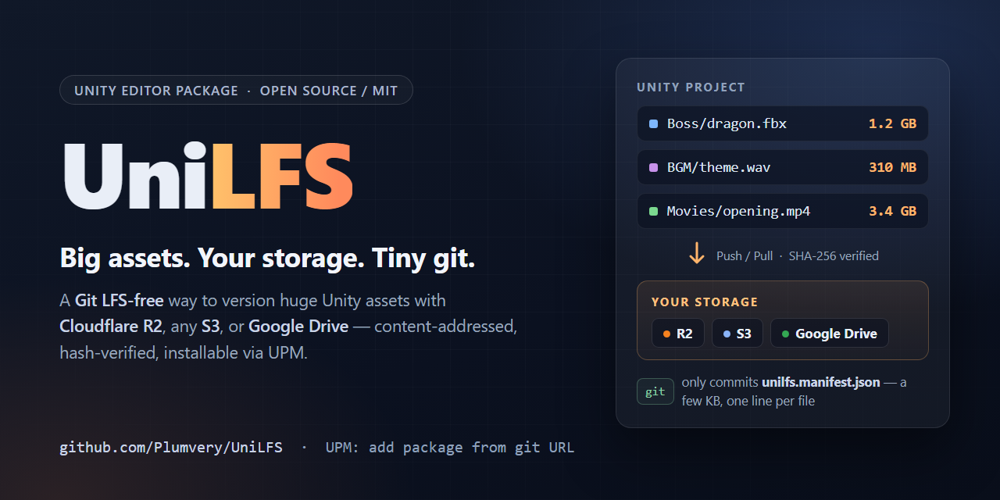
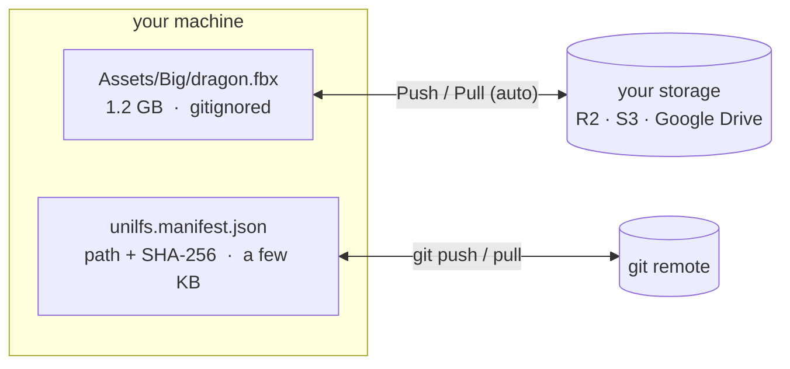

<div align="center">



**Store large Unity assets in your own external storage —<br>Cloudflare R2 / any S3-compatible service / Google Drive — instead of Git LFS.**

[](https://github.com/Plumvery/UniLFS/releases)
<!-- After openupm/openupm#6715 is merged, switch to the live version badge:
[](https://openupm.com/packages/com.plumvery.unilfs/) -->
[](https://github.com/openupm/openupm/pull/6715)
[](https://github.com/Plumvery/UniLFS/actions/workflows/ci.yml)
[](LICENSE.md)
[](#-install)

[**日本語**](README_JA.md) · [Install](#-install) · [Quick start](#-quick-start-cloudflare-r2) · [Track by pattern](#-track-by-pattern-unilfstrack) · [Auto sync](#-auto-sync--no-git-hooks-needed) · [CI](Documentation~/ci.md)

</div>

---

Git LFS free tiers are tiny (GitHub: 1 GB storage / 1 GB bandwidth per month) and Unity projects blow through them fast. UniLFS keeps your big binaries out of git entirely: git only stores a small manifest with content hashes, and the real files live in storage you control — for example R2's free tier gives you 10 GB with **zero egress fees**.

## ✨ Features

- **No git-lfs, no CLI tools, no server** — a pure Unity editor package
- **Bring your own storage** — Cloudflare R2 / Amazon S3 / MinIO / Wasabi (S3 API), or Google Drive
- **`.meta` files stay in git** — and their GUIDs are recorded in the manifest, so a clone never re-imports tracked assets under new ones
- **Content-addressed & verified** — blobs are stored by SHA-256 and every download is hash-checked
- **Auto sync** — missing and outdated files are pulled and local changes are pushed without git hooks
- **Track by pattern** — one committed text file (`unilfs.track`, the `.gitattributes` of this package) says `*.psd` belongs in storage, and new imports are tracked without anyone remembering to
- **Merge-friendly manifest** — one line per file, sorted, so PRs stay reviewable
- **CI ready** — batch mode entry points, env-var credentials, and a Unity-free verify gate

## 🧭 How it works


```mermaid
flowchart LR
    subgraph dev["your machine"]
        A["Assets/Big/dragon.fbx<br/>1.2 GB &nbsp;·&nbsp; gitignored"]
        M["unilfs.manifest.json<br/>path + SHA-256 &nbsp;·&nbsp; a few KB"]
    end
    S[("your storage<br/>R2 · S3 · Google Drive")]
    G[("git remote")]
    A <-- "Push / Pull (auto)" --> S
    M <-- "git push / pull" --> G
```

1. **Track** — you pick large files (or write a pattern like `*.psd` into [`unilfs.track`](#-track-by-pattern-unilfstrack) once and let UniLFS pick them); UniLFS stages them locally (`unilfs.staged.json`) and hides them from git through `.git/info/exclude` right away. Nothing is hashed and nothing committed changes: staging is this machine's intent, not a claim about what exists.
2. **Push** — blobs missing from the remote are uploaded (`objects/<aa>/<sha256>`, deduplicated), and *only then* does the file get its entry in `unilfs.manifest.json` and its line in the managed `.gitignore` block. An entry exists only once storage has the content, for new files as well as changed ones, so a committed manifest never points at a missing blob.
3. **Pull** — teammates (or CI) download whatever the manifest lists that is missing locally, or that someone else has since pushed a newer version of. Downloads are verified against the manifest hash before touching your project.

Editing a tracked file is just: edit → **Push** → commit the manifest change. Switching branches: checkout → **Pull**. Both directions can happen [automatically](#-auto-sync--no-git-hooks-needed).

<details>
<summary>What lands where on disk</summary>

```
your-project/
├── unilfs.manifest.json     ← committed to git (small: path + sha256 + size)
├── unilfs.track             ← committed to git: the patterns that get tracked
├── unilfs.staged.json       ← never committed: tracked here, not pushed yet
├── .gitignore               ← UniLFS maintains a managed block in here
├── Assets/
│   ├── Big/model.fbx        ← gitignored, restored by UniLFS
│   └── Big/model.fbx.meta   ← committed to git as usual
└── UserSettings/UniLFS.json ← your credentials (never committed)

remote storage:
└── unilfs/objects/ab/abcdef1234...   ← blobs named by SHA-256
```

</details>

## 📦 Install

Requires **Unity 2021.3+**.

**Via [OpenUPM](https://openupm.com/packages/com.plumvery.unilfs/)** — recommended; version updates show up in the Package Manager UI:

```sh
openupm add com.plumvery.unilfs
```

<details>
<summary>…or add the scoped registry to <code>Packages/manifest.json</code> manually</summary>

```json
{
  "scopedRegistries": [
    {
      "name": "OpenUPM",
      "url": "https://package.openupm.com",
      "scopes": ["com.plumvery.unilfs"]
    }
  ],
  "dependencies": {
    "com.plumvery.unilfs": "0.2.0"
  }
}
```

</details>

**Via git URL** (needs a git client) — `Window > Package Manager` → `+` → *Add package from git URL*:

```
https://github.com/Plumvery/UniLFS.git#v0.2.0
```

Omit the `#v0.2.0` tag to track `main`.

## 🚀 Quick start (Cloudflare R2)

1. Create an R2 bucket and an API token with *Object Read & Write* — [step-by-step guide](Documentation~/setup-r2.md).
2. In Unity, open `Edit > Project Settings > UniLFS`:
   - Provider: **S3 compatible**
   - Endpoint: `https://<account-id>.r2.cloudflarestorage.com`
   - Bucket: your bucket name, Region: `auto`
   - Access Key ID / Secret Access Key (stored per-user, never committed)
3. Press **Test Connection**.
4. Select big assets in the Project window → right-click → `UniLFS > Track Selected`.
   Or say it once for the whole project: put `*.psd` in [`unilfs.track`](#-track-by-pattern-unilfstrack) and press **Track Matching**.
5. Open `Window > UniLFS` → **Push**.
6. Commit `unilfs.manifest.json`, `unilfs.track`, `.gitignore`, `ProjectSettings/UniLFSSettings.json` and the assets' `.meta` files.
   If the files were already committed to git before, run the `git rm --cached` commands UniLFS prints to the Console.

Teammates then: clone → enter their credentials in Project Settings → open the project. UniLFS notices the missing files and offers to pull them; `Window > UniLFS` → **Pull** works manually too.

Google Drive instead? See [Documentation~/setup-google-drive.md](Documentation~/setup-google-drive.md).

## 🖥️ The UniLFS window (`Window > UniLFS`)

| Button | What it does |
|--------|--------------|
| Refresh | Re-checks every tracked file, and asks storage whether it really has their blobs |
| Push | Uploads new/changed blobs, then records them in the manifest |
| Pull | Downloads files that are missing locally or superseded by a newer version |
| Restore Modified | Overwrites locally modified and conflicting files with the manifest version (asks first) |
| Keep Mine | Resolves conflicting files in favour of your copy — recorded, then uploaded by the next Push |
| Track / Untrack Selected | Same as the `Assets > UniLFS` context menu |
| Track Matching | Tracks every file in the project matching [`unilfs.track`](#-track-by-pattern-unilfstrack) that is not tracked yet |

File states: **staged** (tracked here, never uploaded, so it is not in the manifest and nobody else can see it — run Push) / **up to date** (matches the manifest and the blob is confirmed in storage) / **not pushed** (matches the manifest but this machine has no proof the blob was uploaded) / **modified** (your local edit, not pushed) / **outdated** (someone else pushed a newer version — run Pull) / **conflicted** (changed here *and* in the manifest since you last synced, or tracked separately on both sides) / **missing** (needs Pull).

Telling **modified** from **outdated** takes a third fact, because both just mean "local differs from the manifest" and they need opposite buttons. UniLFS records under `Library/UniLFS/` which manifest hash each file was last in sync with on this machine, and compares against that — the same way a merge base decides which side of a diff actually moved. A **conflicted** file is the case where that comparison says *both* sides moved, or where there is no shared history at all because two people tracked the same path independently; resolve it by hand with **Restore Modified** (take the manifest's version) or **Keep Mine** then Push (keep yours).

Delete `Library/UniLFS/` and any file that is already diverged at that moment reads as **modified** again — the conservative answer, since nothing gets overwritten on a guess. Auto Push leaves those alone rather than assuming yours is the newer one; an explicit Push still takes them. Every file re-learns its baseline the next time local and manifest agree.

"Confirmed in storage" is recorded locally under `Library/UniLFS/` whenever a Push, Pull or Verify proves a blob exists, so drawing the list costs no network calls. **Refresh** is what re-establishes that proof: it asks storage about every blob in the manifest, which is how a fresh clone (which has confirmed nothing yet) stops showing everything as not pushed, and how a blob deleted from the bucket goes back to **not pushed**. Opening the window and the re-check after a Push or Pull stay local-only.

## 🎯 Track by pattern (`unilfs.track`)

Picking files one at a time is fine for a handful of assets and hopeless as a team rule. Write the rule down instead: `unilfs.track` is a committed text file — this package's answer to the `.gitattributes` that `git lfs track` generates, except you edit it in any text editor.

```
# UniLFS: files matching a line below live in storage instead of git.
*.psd
*.mp4
Assets/Movies/
!Assets/Movies/thumbs/*.png
```

| Line | Means |
|------|-------|
| `*.psd` | no slash: matched against the *file name*, at any depth |
| `Assets/Movies/` | trailing slash: everything under that folder |
| `Assets/**/*.wav` | `**` crosses folders, `*` stays inside one name, `?` is one character |
| `!Assets/UI/*.psd` | `!` excludes — and the **last matching line wins**, so a later line can re-include |
| `# note` | comments and blank lines are ignored |

Case is ignored. Whatever you write, `.meta` files, the UniLFS files themselves and anything under `Library/`, `Temp/`, `Logs/`, `obj/`, `UserSettings/` or `.git/` never match.

Two things act on it:

- **Track Matching** (`Window > UniLFS`) sweeps the whole project and tracks every match that is not tracked yet — what you run after writing the file, or after `git pull` brings a teammate's new pattern.
- **Auto Track** (on by default, `Edit > Project Settings > UniLFS`) tracks matching files as they are imported or moved, so a new `.psd` is out of git from the moment it lands.

Both only *track*: files are staged on this machine and hidden from git, and **Push** is still the only thing that uploads them and writes the manifest. Untracking a file that a pattern matches re-tracks it on the next import — write a `!` line for it instead.

In batch mode: `-executeMethod UniLFS.Editor.UniLfsCli.Track`, followed by `...UniLfsCli.Push`.

## 🔄 Auto sync — no git hooks needed

Because the real bytes only exist on the machines that edit them, syncing has to start client-side (git-lfs works the same way). UniLFS automates both directions from inside the editor, and gives CI a cheap way to catch anything that slips through:

**Auto Pull** — whenever the editor starts or regains focus (exactly what happens right after you run `git pull`), and only when the manifest file itself has changed since the last check, UniLFS re-checks tracked files. If any are missing or outdated, the setting decides: **Ask** (default, dialog), **Automatic** (background download), or **Off** (Console warning only).

**Auto Push** — when tracked files have local changes that were never uploaded, UniLFS notices (on focus changes, and in Automatic mode right after the asset is saved/imported) and offers to push — so blobs are already in storage by the time you commit the manifest. Same three modes, default **Ask**.

**CI verify gate** — a [stdlib-only Python script](Documentation~/ci/verify_manifest.py) (no Unity license needed) fails your CI when a committed manifest references blobs missing from storage: the "forgot to push" case can't reach `main` unnoticed. Also available as `UniLfsCli.Verify` and as a pre-push hook — see [Documentation~/ci.md](Documentation~/ci.md).

Configure the modes in `Edit > Project Settings > UniLFS`. Each detected state is handled at most once per editor session, so declining a dialog won't nag you on every focus change.

## 🔐 Configuration & credentials

| File | Committed? | Contents |
|------|-----------|----------|
| `unilfs.manifest.json` | ✅ | tracked paths + SHA-256 + size, for content Push confirmed is in storage |
| `unilfs.track` | ✅ | the patterns whose files belong in storage — plain text, edited by hand |
| `unilfs.staged.json` | ❌ (auto-gitignored) | paths tracked on this machine and not pushed yet |
| `ProjectSettings/UniLFSSettings.json` | ✅ | provider, endpoint, bucket, folder ID, ... |
| `.gitignore` (managed block) | ✅ | the manifest's paths, the credential file, the staging file |
| `UserSettings/UniLFS.json` | ❌ (auto-gitignored) | access keys, OAuth refresh token |

Environment variables override everything (useful for CI):
`UNILFS_S3_ACCESS_KEY_ID`, `UNILFS_S3_SECRET_ACCESS_KEY`, `UNILFS_DRIVE_CLIENT_ID`, `UNILFS_DRIVE_CLIENT_SECRET`, `UNILFS_DRIVE_REFRESH_TOKEN`.

Credentials are stored in plain text in `UserSettings/UniLFS.json` (like `~/.aws/credentials`). UniLFS force-includes that file in its `.gitignore` block, but treat the file like any other secret.

## 🤖 CI

```sh
Unity -batchmode -nographics -quit -projectPath . \
  -executeMethod UniLFS.Editor.UniLfsCli.Pull
```

`Pull` / `Push` / `Track` / `Verify` / `Status` are available; errors make the process exit non-zero. (`Track` stages everything `unilfs.track` matches; run `Push` after it to upload.) For the Unity-free verify gate and full GitHub Actions examples, see [Documentation~/ci.md](Documentation~/ci.md).

## 🔀 Merge behavior

The manifest is sorted with one line per file, so two people tracking *different* files merge cleanly. If two people change the *same* file you get a one-line conflict — pick the hash you want and run **Pull** (use **Restore Modified** to overwrite your local copy). Blobs for both versions exist remotely, so nothing is lost either way.

## ⚠️ Limitations (v0.2)

- No file locking (as with plain git — coordinate who edits shared binaries)
- No garbage collection of old blobs yet (storage is cheap; `prune` is on the roadmap)
- Single-request uploads: ~5 GB per-object limit on R2/S3
- Google Drive is best for solo/small-team use — see the rate-limit and quota notes in its guide
- Editor-only: files must be pulled before building (that is what the CI entry point is for)

## 🗺️ Roadmap

- Blob pruning / GC
- Multipart uploads
- OpenUPM listing

PRs and issues welcome!

## 📄 License

[MIT](LICENSE.md) © [Plumvery](https://github.com/Plumvery)
