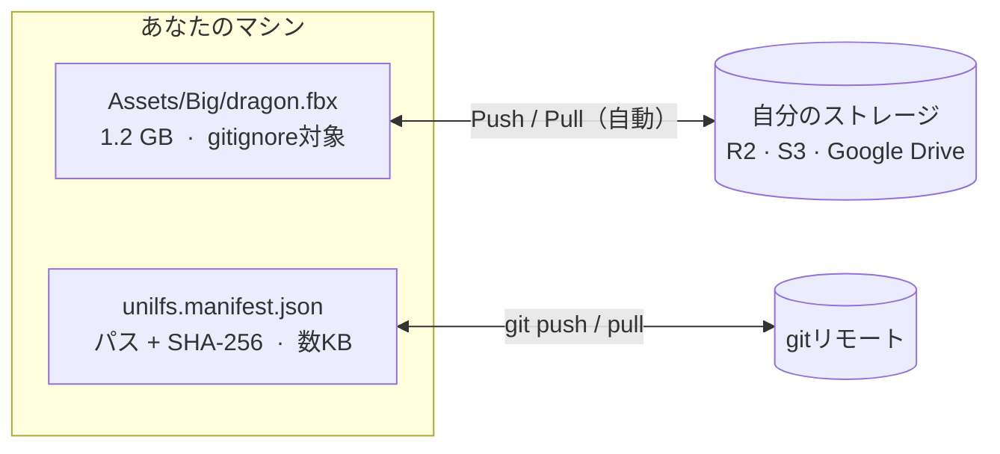

<div align="center">


**Unityの大容量アセットを、Git LFSの代わりに自分の外部ストレージへ<br>（Cloudflare R2 / S3互換サービス / Google Drive）**

[](https://github.com/Plumvery/UniLFS/releases)
<!-- After openupm/openupm#6715 is merged, switch to the live version badge:
[](https://openupm.com/packages/com.plumvery.unilfs/) -->
[](https://github.com/openupm/openupm/pull/6715)
[](https://github.com/Plumvery/UniLFS/actions/workflows/ci.yml)
[](LICENSE.md)
[](#-インストール)

[**English**](README.md) · [インストール](#-インストール) · [クイックスタート](#-クイックスタートcloudflare-r2) · [自動同期](#-自動同期--gitフック不要) · [CI](Documentation~/ci.md)

</div>

---

Git LFSの無料枠は小さく（GitHubはストレージ1GB・帯域1GB/月）、Unityプロジェクトではすぐ溢れます。UniLFSは大きいバイナリをgitから完全に切り離します。gitにはコンテンツハッシュを記録した小さなマニフェストだけをコミットし、実ファイルは自分で管理するストレージに置きます。たとえばR2の無料枠は10GB、**下り転送は無料**です。

## ✨ 特徴

- **git-lfs不要・CLIツール不要・サーバー不要** — 純粋なUnityエディタパッケージ
- **ストレージは自分で選ぶ** — Cloudflare R2 / Amazon S3 / MinIO / Wasabi（S3 API）、または Google Drive
- **`.meta`はgitに残る** — GUIDはマニフェストにも記録するので、クローンしても新しいGUIDで取り込み直されない
- **コンテンツアドレス方式＋検証付き** — ブロブはSHA-256名で保存し、ダウンロードは必ずハッシュ検証
- **自動同期** — gitフック無しで、欠けたファイルのPullもローカル変更のPushも自動
- **マージしやすいマニフェスト** — 1ファイル1行・ソート済みなのでPRがレビューしやすい
- **CI対応** — バッチモード用エントリポイント、環境変数での認証、Unity不要の検証ゲート

## 🧭 仕組み



1. **Track** — 大きいファイルを選ぶと、UniLFSがSHA-256を`unilfs.manifest.json`に記録し、`.gitignore`の管理ブロックへ追加します。
2. **Push** — リモートに無いブロブだけをアップロードします（`objects/<aa>/<sha256>`、重複排除）。アップロード確認後にのみマニフェストへ新ハッシュを書くので、コミットされたマニフェストが「存在しないブロブ」を指すことはありません。
3. **Pull** — チームメイト（やCI）は、マニフェストにあってローカルに無いファイルをダウンロードします。プロジェクトに書き込む前に必ずハッシュ検証します。

追跡中ファイルの更新は「編集 → **Push** → マニフェストの差分をコミット」。ブランチ切り替えは「checkout → **Pull**」だけ。どちらも[自動化](#-自動同期--gitフック不要)できます。

<details>
<summary>ディスク上の配置</summary>

```
your-project/
├── unilfs.manifest.json     ← gitにコミット（パス + sha256 + サイズだけの小さいファイル）
├── .gitignore               ← UniLFSが管理ブロックを自動維持
├── Assets/
│   ├── Big/model.fbx        ← gitignoreされ、UniLFSが復元する
│   └── Big/model.fbx.meta   ← 普通にgitへコミット
└── UserSettings/UniLFS.json ← 認証情報（コミットされない）

リモートストレージ:
└── unilfs/objects/ab/abcdef1234...   ← SHA-256名のブロブ
```

</details>

## 📦 インストール

**Unity 2021.3+** が必要です。

**[OpenUPM](https://openupm.com/packages/com.plumvery.unilfs/) 経由**（推奨。Package Manager UIにバージョン更新が表示されます）:

```sh
openupm add com.plumvery.unilfs
```

<details>
<summary>…または <code>Packages/manifest.json</code> にスコープレジストリを手動追加</summary>

```json
{
  "scopedRegistries": [
    {
      "name": "OpenUPM",
      "url": "https://package.openupm.com",
      "scopes": ["com.plumvery.unilfs"]
    }
  ],
  "dependencies": {
    "com.plumvery.unilfs": "0.2.0"
  }
}
```

</details>

**git URL経由**（gitクライアントが必要）— `Window > Package Manager` → `+` → *Add package from git URL*:

```
https://github.com/Plumvery/UniLFS.git#v0.2.0
```

`#v0.2.0` を省くと `main` 追従になります。

## 🚀 クイックスタート（Cloudflare R2）

1. R2バケットと *Object Read & Write* 権限のAPIトークンを作成 — [手順ガイド](Documentation~/setup-r2.md)
2. Unityで `Edit > Project Settings > UniLFS` を開く:
   - Provider: **S3 compatible**
   - Endpoint: `https://<アカウントID>.r2.cloudflarestorage.com`
   - Bucket: バケット名、Region: `auto`
   - Access Key ID / Secret Access Key（ユーザーごとに保存、コミットされない）
3. **Test Connection** を押す
4. Projectウィンドウで大きいアセットを選択 → 右クリック → `UniLFS > Track Selected`
5. `Window > UniLFS` を開いて **Push**
6. `unilfs.manifest.json`・`.gitignore`・`ProjectSettings/UniLFSSettings.json`・アセットの`.meta`をコミット。
   すでにgitにコミット済みだったファイルは、Consoleに表示される `git rm --cached` コマンドを実行してください。

チームメイトは「clone → Project Settingsで自分の認証情報を入力 → プロジェクトを開く」だけ。UniLFSが欠けているファイルを検知してPullを提案します。もちろん `Window > UniLFS` → **Pull** の手動操作も可能です。

Google Driveを使う場合は [Documentation~/setup-google-drive.md](Documentation~/setup-google-drive.md) へ。

## 🖥️ UniLFSウィンドウ（`Window > UniLFS`）

| ボタン | 動作 |
|--------|------|
| Refresh | 全追跡ファイルを再チェックし、blobがストレージに実在するかをストレージ側に問い合わせ |
| Push | 新規/変更ブロブをアップロードし、マニフェストを更新 |
| Pull | ローカルに無いファイルをダウンロード |
| Restore Modified | ローカル変更をマニフェストの版で上書き（確認ダイアログあり） |
| Track / Untrack Selected | `Assets > UniLFS` の右クリックメニューと同じ |

状態表示: **up to date**（マニフェストと一致し、ストレージ上の blob も確認済み）/ **not pushed**（マニフェストとは一致するが、このマシンからのアップロードが確認できていない。Track しただけで未 Push の場合など）/ **modified**（未Pushのローカル変更あり）/ **missing**（Pullが必要）。

「確認済み」かどうかは Push / Pull / Verify が blob の存在を証明したときに `Library/UniLFS/` へ記録されるため、一覧の描画自体にネットワーク通信は発生しません。その証明を取り直すのが **Refresh** ボタンで、マニフェスト上の全 blob をストレージに問い合わせます。clone 直後（まだ何も確認していない状態）で全ファイルが not pushed 表示になるのが解消されるのも、バケットから消された blob が **not pushed** に戻るのもこの経路です。ウィンドウを開いたときと Push / Pull 直後の再チェックはローカルのみで、通信は発生しません。

## 🔄 自動同期 — gitフック不要

実ファイルのバイト列は「編集したマシン」にしか存在しないため、同期は必ずクライアント側から始まります（git-lfsも同じ仕組みです）。UniLFSはエディタ内から双方向を自動化し、すり抜けはCIで検出します:

**Auto Pull** — エディタの起動時・フォーカス復帰時（＝`git pull`した直後）に軽量な存在チェックを実行。マニフェストが変わっていてファイルが欠けていたら、設定に応じて **Ask**（デフォルト・ダイアログ）/ **Automatic**（バックグラウンドでダウンロード）/ **Off**（Console警告のみ）。

**Auto Push** — 未アップロードのローカル変更を検知すると（フォーカス切替時、Automaticならアセット保存・インポート直後にも）Pushを提案。マニフェストをコミットする頃にはblobがストレージに揃っている状態を作ります。同じ3モードでデフォルトは **Ask**。

**CI検証ゲート** — [Python標準ライブラリだけのスクリプト](Documentation~/ci/verify_manifest.py)（UnityライセンスもUnity自体も不要）が、コミットされたマニフェストの参照するblobがストレージに無い場合にCIを失敗させます。「Pushし忘れ」がmainに気づかれず入ることはありません。`UniLfsCli.Verify`やpre-pushフックとしても使えます — 詳細は [Documentation~/ci.md](Documentation~/ci.md)。

モード設定は `Edit > Project Settings > UniLFS`。同じ状態につきエディタセッション中1回しか反応しないので、「Later」を選んでもフォーカスのたびに聞かれることはありません。

## 🔐 設定と認証情報

| ファイル | コミット | 内容 |
|----------|---------|------|
| `unilfs.manifest.json` | ✅ | 追跡パス + SHA-256 + サイズ |
| `ProjectSettings/UniLFSSettings.json` | ✅ | プロバイダ、エンドポイント、バケット、フォルダIDなど |
| `.gitignore`（管理ブロック） | ✅ | 追跡ファイルのパス、認証ファイル |
| `UserSettings/UniLFS.json` | ❌（自動でgitignore） | アクセスキー、OAuthリフレッシュトークン |

環境変数が最優先です（CI向け）:
`UNILFS_S3_ACCESS_KEY_ID`, `UNILFS_S3_SECRET_ACCESS_KEY`, `UNILFS_DRIVE_CLIENT_ID`, `UNILFS_DRIVE_CLIENT_SECRET`, `UNILFS_DRIVE_REFRESH_TOKEN`

認証情報は `UserSettings/UniLFS.json` に平文で保存されます（`~/.aws/credentials`と同様の方式）。UniLFSはこのファイルを必ず`.gitignore`ブロックに含めますが、シークレットとして扱ってください。

## 🤖 CI

```sh
Unity -batchmode -nographics -quit -projectPath . \
  -executeMethod UniLFS.Editor.UniLfsCli.Pull
```

`Pull` / `Push` / `Verify` / `Status` が使えます。エラーがあるとプロセスは非ゼロで終了します。Unity不要の検証ゲートとGitHub Actionsの実例は [Documentation~/ci.md](Documentation~/ci.md) へ。

## 🔀 マージの挙動

マニフェストは1ファイル1行・ソート済みなので、**別々の**ファイルを追跡した2人の変更はきれいにマージされます。**同じ**ファイルを2人が変更した場合は1行のコンフリクトになるので、採用したいハッシュを選んで **Pull**（自分のローカル版を上書きするなら **Restore Modified**）してください。どちらの版のブロブもリモートに存在するので、データが失われることはありません。

## ⚠️ 制限事項（v0.2）

- ファイルロック機能なし（素のgitと同じく、バイナリを誰が編集するかはチームで調整）
- 古いブロブのGCは未実装（ストレージは安価。`prune`はロードマップにあり）
- アップロードは単一リクエスト: R2/S3ではオブジェクトあたり約5GBまで
- Google Driveは個人〜小規模チーム向き（レート制限・容量の注意はガイド参照）
- エディタ専用: ビルド前にPullが必要（そのためのCIエントリポイントです）

## 🗺️ ロードマップ

- ブロブのprune / GC
- パターン指定の自動追跡（フォルダ以下を全部追跡など）
- マルチパートアップロード
- OpenUPM掲載

PR・Issue歓迎です！

## 📄 ライセンス

[MIT](LICENSE.md) © [Plumvery](https://github.com/Plumvery)
